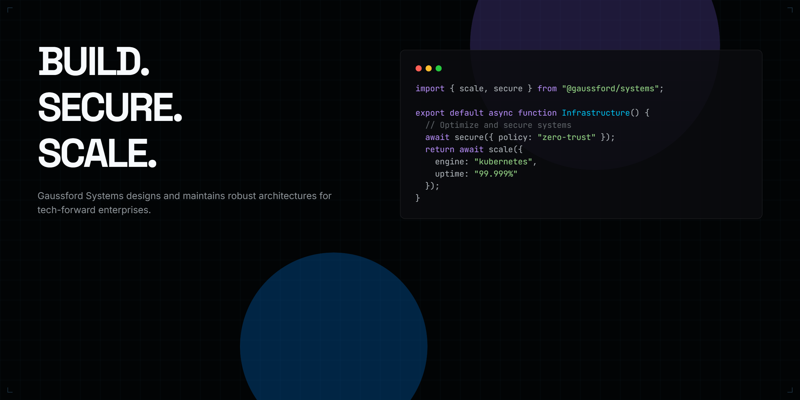

<div align="center">

# Gaussford Systems

### Business Engineering.

**The Engineering Company Behind Tomorrow's Businesses.**

<p>
  <a href="https://gaussford.systems">Website</a>
  •
  <a href="https://linkedin.com/company/gaussford">LinkedIn</a>
  •
  <a href="https://github.com/Gaussford-Systems">GitHub</a>
</p>

---



<br>


</div>

---

# Businesses aren't built.

# They're engineered.

Most companies deliver software.

We engineer businesses.

Every serious business is a collection of interconnected systems—

- Strategy
- Brand
- Software
- Infrastructure
- Security
- Operations

Treating these independently creates technical debt.

Gaussford engineers them as one operating system designed to perform, evolve and compound over time.

---

# Engineering Philosophy

Business Engineering is the discipline of designing, launching and growing businesses with the same rigour used to engineer world-class software.

Everything compounds.

Architecture.

Decisions.

Processes.

Culture.

Technology.

The companies that endure are the ones engineered deliberately.

---

# Engineering Principles

## P01 — Systems over Deliverables

We don't optimise for websites, apps or one-time launches.

We engineer complete business systems.

---

## P02 — Engineered for the Decade

Technology changes.

Principles don't.

Every architecture is designed to remain useful after years of iteration, growth and change.

---

## P03 — Long-term Partnership

Launching isn't the finish line.

It's the beginning.

We continue engineering alongside the businesses we build.

---

## P04 — Discipline before Speed

Speed without discipline creates expensive companies.

Measurement, simplicity and engineering judgement always come first.

---

# Engineering Systems

Every engagement belongs to one of four operating systems.

---

## S-01 • GaussBox

### Where Great Businesses Begin.

Business launch system.

Modules

- Business Strategy
- Brand Engineering
- Websites
- Software
- Infrastructure
- CRM
- Analytics
- Documentation
- Security

---

## S-02 • GaussFort

### Protect. Monitor. Maintain. Scale.

Operations engineering.

Modules

- Hosting
- Security
- Monitoring
- Maintenance
- Incident Response
- Business Continuity

---

## S-03 • GaussForge

### Engineering, On Demand.

Engineering engagements.

Modules

- Web Engineering
- AI Engineering
- Automation
- APIs
- Cloud
- DevOps
- SEO Engineering
- Analytics

---

## S-04 • GaussLabs

### Research. Innovation. Open Source.

Our engineering research division.

Modules

- Research
- Open Source
- AI Research
- Security Research
- Developer Tools
- Design Systems
- Benchmarks
- Engineering Articles

---

# Engineering Disciplines

Our ecosystem spans multiple engineering domains.

- Business Strategy
- Brand Engineering
- Software Engineering
- Cloud Engineering
- AI Engineering
- Cybersecurity Engineering
- Infrastructure Engineering
- Automation Engineering
- SEO Engineering

Every discipline follows the same standards.

Every discipline integrates into the same architecture.

---

# The Gauss Method

Every business moves through six engineering phases.

```
Observe
     ↓
Architect
     ↓
Engineer
     ↓
Validate
     ↓
Launch
     ↓
Evolve
```

No guesswork.

Only disciplined engineering.

---

# Engineering Standards

| Standard | Target |
|-----------|--------|
| Performance | 98+ Lighthouse |
| Security | A+ Observatory |
| Accessibility | WCAG 2.2 AA |
| Type Safety | 100% Typed |
| Scalability | 10× Capacity Headroom |
| Documentation | Complete Handover |

Engineering isn't finished until it is maintainable.

---

# Open Source

Knowledge compounds.

GaussLabs exists to publish the frameworks, libraries, research and developer tools that emerge from solving real business problems.

Open source isn't marketing.

It's engineering documentation.

---

# Engineering Library

Coming soon.

- Business Engineering as a Discipline
- Designing for the Decade
- Systems Before Software
- Engineering Trust
- Infrastructure as Business Strategy
- The Cost of Short-term Architecture
- Building Compounding Companies

---

# Our Repositories

| Repository | Purpose |
|------------|---------|
| **gaussbox** | Business Launch System |
| **gaussfort** | Operations Engineering |
| **gaussforge** | Engineering Toolkit |
| **gausslabs** | Research Division |
| **engineering-library** | Essays & Documentation |
| **gaussford.com** | Official Website |

---

# Start Engineering

Whether you're launching a new company or rebuilding an existing one—

engineer it properly.

Start with a Gauss Audit.

---

<div align="center">

## Gaussford Systems

### Business Engineering.

*Engineering companies behind tomorrow's businesses.*

<br>

Website • LinkedIn • GitHub

</div>
